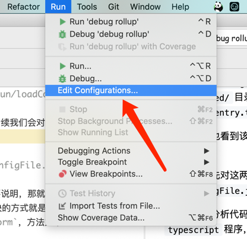
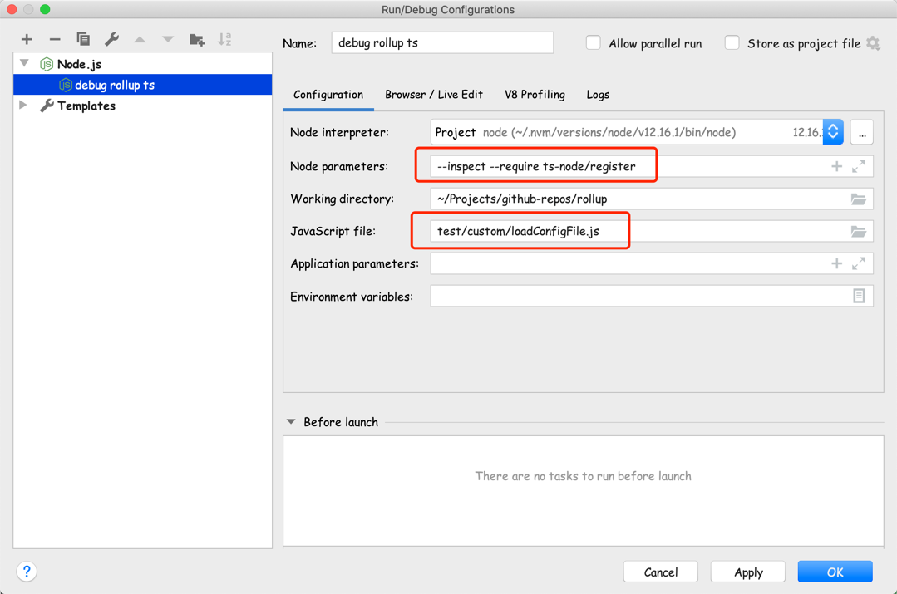

# Rollup 源码分析 (v2.42.3)

> 前面分析了 rollup.js v0.3 版本的内部流程，大概了解了它内部的工作原理，但毕竟版本太老，可参考价值不大，所以现在分析目前最新版(v2.42.3)的内部工作原理。

首先是源码构建工具的改变，之前是使用的原生 `js` 进行开发，使用 `gobble` 进行打包构建。而现在是采用 `ts` 进行源码开发，使用 `rollup` 本身来打包构建。所以，就需要对这两种技术的了解才能进一步分析源码了。

首先，`rollup`会使用`rollup -c`命令对整个源码进行打包构建，所以需要对项目根目录下面的`rollup.config.js`文件了如指掌，才能更好的分析后面的源码结构。

## rollup.config.js 分析
跳过开头的一堆`import`语句，第一条语句是一个`iife`，如下：
```js
const commitHash = (function () {
    try {
        return fs.readFileSync('.commithash', 'utf-8');
    } catch (err) {
        return 'unknown';
    }
})();
```
就是获取根目录下`.commithash`文件的内容，保存到`commitHash`变量里面。这个文件会在构建之前通过命令`git rev-parse HEAD > .commithash`写入，用来获取执行`build`时所在分支的`commit hash`，来表示本次构建是在哪个提交上进行的。

然后是定义构建的当前时间：
```js
const now = new Date(
    process.env.SOURCE_DATE_EPOCH ? process.env.SOURCE_DATE_EPOCH * 1000 : new Date().getTime()
).toUTCString();
```
这个涉及到可重复构建的概念，详情可参考[SOURCE_DATE_EPOCH 环境变量](https://reproducible-builds.org/docs/source-date-epoch/) 以及 [Reproducible builds 项目](https://reproducible-builds.org/)

然后是`banner`定义：
```js
const banner = `/*
  @license
  Rollup.js v${pkg.version}
  ${now} - commit ${commitHash}

  https://github.com/rollup/rollup

  Released under the MIT License.
*/`;
```
这个你看下打包后的`rollup.js`文件就知道是干什么的了。

接着，定义了`moduleAliases`、`treeshake`、`nodePlugins`等配置，然后就是`rollup.config.js`的主体：
```js
export default command => {
    const commonJSBuild = {}
    const esmBuild = {}
    const browserBuilds = {}
    
    return [commonJSBuild, esmBuild, browserBuilds]
}
```
阅读下文档就基本知道，这样的配置可以同时构建3个不相关的包(Bundle)，分别对应`CommonJS`、`ESM`和`Browser`这3种不同规范的结果。 我们重点关注配置里面的`input`、`output`字段。

下面，我们来一个个的分析：

## CommonJS 构建
我们看下这个构建的配置：
```js
const commonJSBuild = {
    input: {
        'rollup.js': 'src/node-entry.ts',
        'loadConfigFile.js': 'cli/run/loadConfigFile.ts'
    },
    plugins: [
        ...nodePlugins,
        addCliEntry(),
        esmDynamicImport(),
        !command.configTest && collectLicenses()
    ],
    // fsevents is a dependency of chokidar that cannot be bundled as it contains binary code
    external: [
        'assert',
        'crypto',
        'events',
        'fs',
        'fsevents',
        'module',
        'path',
        'os',
        'stream',
        'url',
        'util'
    ],
    treeshake,
    strictDeprecations: true,
    output: {
        banner,
        chunkFileNames: 'shared/[name].js',
        dir: 'dist',
        entryFileNames: '[name]',
        exports: 'auto',
        externalLiveBindings: false,
        format: 'cjs',
        freeze: false,
        interop: id => {
            if (id === 'fsevents') {
                return 'defaultOnly';
            }
            return 'default';
        },
        manualChunks: { rollup: ['src/node-entry.ts'] },
        sourcemap: true
    }
};
```

首先要弄懂几个概念：

- `chunk`
构建结果如果要写入文件系统，则每一个文件都被称为是一个`Chunk`，`Chunk`的文件名采用`output.entryFileNames`配置，但如果在`output`中同时指定了`file`选项的话，则`file`选项的优先级更高。

>  `Chunk`分为`Entry Chunk`和`Shared Chunk`，`Entry Chunk`是`input`选项中配置的入口文件所生成的`Chunk`，`Shared Chunk`是代码拆分(code-splitting)时分离出的可公用的`Chunk`。
  
- `output.entryFileNames`
  为入口文件所生成的`chunk`，也就是`entry chunk`命名
  
- `output.chunkFileNames`
  为代码拆分(code-splitting)时生成的`shared chunk`命名

- `output.assetFileNames`
  这个配置用于在`build output`阶段自定义`emit`的资源文件命名。可能配合插件使用吧。
  

根据`commonJSBuild`的配置以及上面的说明，我们可以知道，该配置会生成2个`entry chunk`，分别是`dist/rollup.js`和`dist/loadConfigFile.js`，以及一系列`shared chunk`，位于`dist/shared/`目录下面。2个`entry chunk`对应的入口文件分别是`src/node-entry.ts`和`cli/run/loadConfigFile.ts`。

同时，我们也看到该配置含有多个插件，后续我们会对这里面的插件进行介绍。

下面，我们先对这两个`entry chunk`进行分析，就从简单的`loadConfigFile.js`开始吧。

在正式开始分析代码之前，还有一件事需要说明，那就是要会使用工具调试`typescript`程序，因为学习源码最快的方式就是打断点调试，查看程序执行流程。我这里用的编辑器是`webstorm`，方法如下：
1. 安装依赖
```shell
npm install typescript ts-node
```

2. 添加`typescript`程序的调试配置

通过菜单【Run】->【Edit Configurations...】打开【Run/Debug Configurations】对话框，如下图：


添加`node.js`程序，配置如下：

   
除此之外，`rollup`的源码对模块的引用大部分都是需要配合`rollup`本身的配置才能构建的，比如下面这样的语句：
```js
import help from 'help.md';
import { version } from 'package.json';
```
都是利用了`rollup.config.js`中配置的`moduleAliases`，该配置如下：
```js
const moduleAliases = {
    resolve: ['.js', '.json', '.md'], 
    entries: [
        { find: 'help.md', replacement: path.resolve('cli/help.md') },
        { find: 'package.json', replacement: path.resolve('package.json') },
        { find: 'acorn', replacement: path.resolve('node_modules/acorn/dist/acorn.mjs') }
    ]
};
```
所以，基于以上原因，想要直接去调试原始的源码很困难，所以我将原始的`rollup v2.42.3`源码重新整理了一遍(**主要就是修改`import/export`语句**)，放在了`v2.42.3`目录下面。

### loadConfigFile.ts 分析
入口文件为`cli/run/loadConfigFile.ts`

首先，看一下官方文档对该 api 的描述，[Programmatically loading a config file](https://rollupjs.org/guide/en/#programmatically-loading-a-config-file) ，
我的测试代码如下：
```js
const path = require('path');
const loadAndParseConfigFile = require('../../cli/run/loadConfigFile');

const fileName = path.resolve(__dirname, 'rollup.config.js');
loadAndParseConfigFile(fileName, { format: 'es' })
  .then(async ({ options, warnings }) => {
    // "warnings" wraps the default `onwarn` handler passed by the CLI.
    // This prints all warnings up to this point:
    console.log(`We currently have ${warnings.count} warnings`);

    // This prints all deferred warnings
    warnings.flush();

    // options is an array of "inputOptions" objects with an additional "output"
    // property that contains an array of "outputOptions".
    // The following will generate all outputs for all inputs, and write them to disk the same
    // way the CLI does it:
    console.log(options);
  });
```


### node-entry.ts 分析
todo

### 插件分析
[Rollup 插件分析](rollup-plugins-v2.42.3.md)

## ESM 构建
我们看下`esm`的构建配置：
```js
const esmBuild = {
    ...commonJSBuild,
    input: { 'rollup.js': 'src/node-entry.ts' },
    plugins: [
        ...nodePlugins,
        emitModulePackageFile(),
        collectLicenses()
    ], 
    output: {
        ...commonJSBuild.output,
        dir: 'dist/es',
        format: 'es',
        sourcemap: false,
        minifyInternalExports: false
    }
};
```
可以看到，与`CommonJS`配置相比，`input`里面只有`rollup.js`入口了，插件里面多了2个，`ouput`里面也做了相关调整。整体上看，基本与`CommonJS`一致，入口文件也一致，只有输出格式和输出位置不一样而已。

## Browser 构建
最后，我们来看下`Browser`的构建配置：
```js
const browserBuilds = {
    input: 'src/browser-entry.ts',
    plugins: [
        replaceBrowserModules(),
        alias(moduleAliases),
        resolve({ browser: true }),
        json(),
        commonjs(),
        typescript(),
        terser({ module: true, output: { comments: 'some' } }),
        collectLicenses(),
        writeLicense()
    ],
    treeshake,
    strictDeprecations: true,
    output: [
        {
            file: 'dist/rollup.browser.js', 
            format: 'umd',
            name: 'rollup',
            banner, 
            sourcemap: true
        },
        {
            file: 'dist/es/rollup.browser.js',
            format: 'es',
            banner
        }
    ]
};
```
可以看到，入口文件变成了`src/browser-entry.ts`了，插件列表也完全替换成新的了，分别输出了老版浏览器的`umd`格式和现代浏览器的`es`格式。

我们需要从新的入口`src/browser-entry.ts`开始分析了。

### browser-entry.ts 分析
todo
